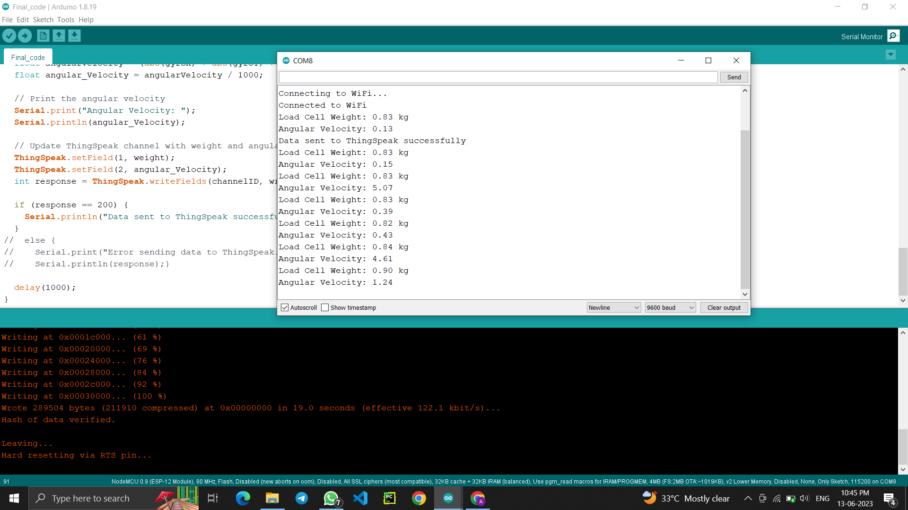

# 🚴‍♂️ IoT-Based System for Monitoring and Optimizing Cyclist Performance

## Overview

This project presents an **IoT-based system** designed to optimize cyclist performance through real-time feedback and data analysis. It employs a **50 kg Load Cell force sensor** attached to the bike’s pedal and a **Gyroscope sensor** for measuring elevation changes. The system aims to help cyclists improve their performance, reduce the risk of injury, and achieve their fitness goals by providing valuable insights and feedback.

## Features

- **Real-Time Data Collection**: Continuous monitoring of cyclist’s performance.
- **Force Measurement**: Captures the force exerted by the cyclist during pedaling.
- **Elevation Detection**: Measures terrain inclines and declines.
- **User-Friendly Interface**: Provides immediate feedback to the cyclist.
- **Performance Insights**: Offers personalized suggestions for improvement.

## Motivation

Cycling is a popular fitness activity, and optimizing performance can significantly enhance the cycling experience. Our system leverages IoT technology to provide real-time insights, helping cyclists to make informed decisions and achieve their fitness goals effectively.

## System Architecture


## Implementation

1. **Initialization**: Setting up the microcontroller (NodeMCU ESP8266), sensors (MPU6050 gyroscope and load cell), and connections.
2. **Data Acquisition**: Sensors collect data on motion and exertion continuously.
3. **Data Processing**: Data from sensors is processed to extract meaningful information.
4. **Exertion Level Calculation**: Analyzes angular velocity to determine exertion levels.
5. **Weight and BMI Calculation**: Converts force measurements to weight values and calculates BMI.
6. **Data Logging and Visualization**: Processed data is logged and visualized using platforms like ThingSpeak.

## Results

### Serial Monitor of Arduino IDE


### Load Cell Graph


### Gyroscope Graph


### ThingSpeak Cloud


## Conclusion and Future Scope

The proposed IoT-based system provides a promising solution to enhance the cycling experience. By integrating sensors and real-time feedback, it enables cyclists to optimize their performance, reduce injury risks, and achieve fitness goals. Future enhancements could include integration with wearable devices and collaboration with cycling analytics platforms.

## Collaboration

We welcome contributions from the community! Follow these steps to collaborate:

1. **Fork the Repository**: Click the "Fork" button at the top right of this page.
2. **Clone Your Fork**: Clone your forked repository to your local machine.
   ```sh
   git clone https://github.com/RushikeshSonwane03/IOT_Project.git
   ```
3. **Create a Branch**: Create a new branch for your feature or bug fix
    ```sh 
    git checkout -b feature-name
    ```
4. **Make Changes**: Implement your changes and commit them with clear messages.
    ```sh
    git commit -m "Description of your changes" 
    ```
5. **Push Changes**: Push your changes to your forked repository.
    ```sh
    git push origin feature-name
    ```
6. **Create a Pull Request**: Open a pull request from your forked repository to our main repository.

## Acknowledgments

We extend our heartfelt thanks to our project guide, Dr. Makrand Shahade, and our department head, Dr. Nilesh Salunke, for their invaluable support and guidance. Special thanks to Prof. Mayuri Kulkarni (IoT Expert) and Prof. Ashish Awate (ML Expert) for their expert advice.


## Contact

For any inquiries or feedback, please contact:

Anushka Jain
Mansi Patil
Purva Chauhan
Rushikesh Sonwane

# Made with ❤️ by the team at SVKM’s Institute of Technology, Dhule
