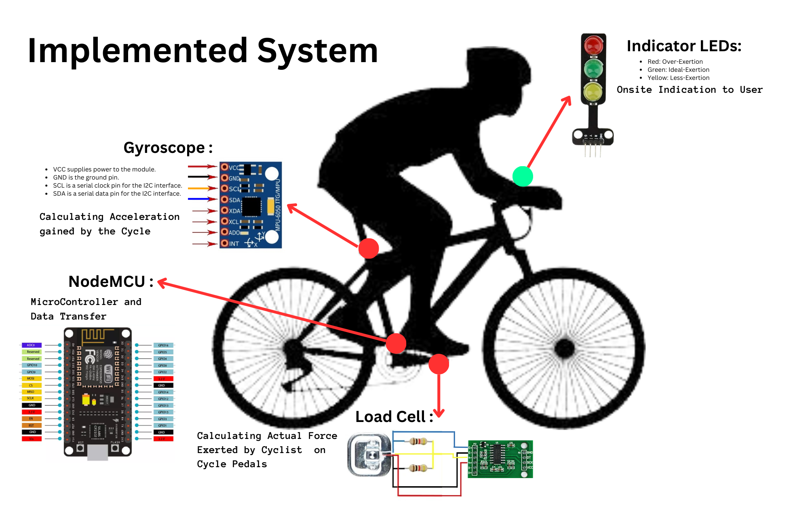
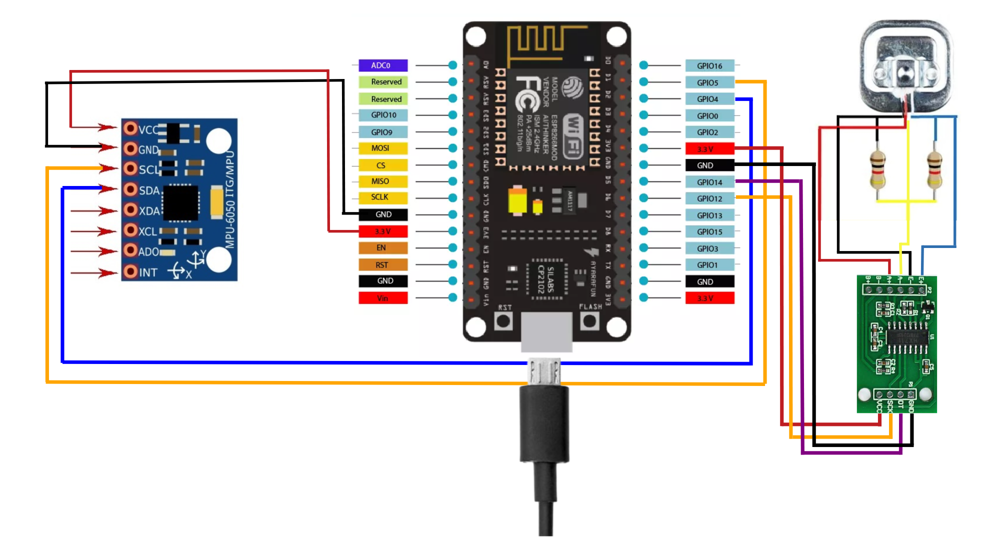
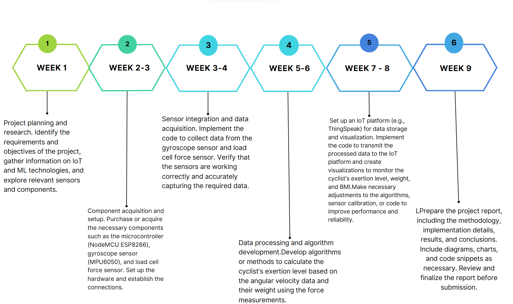
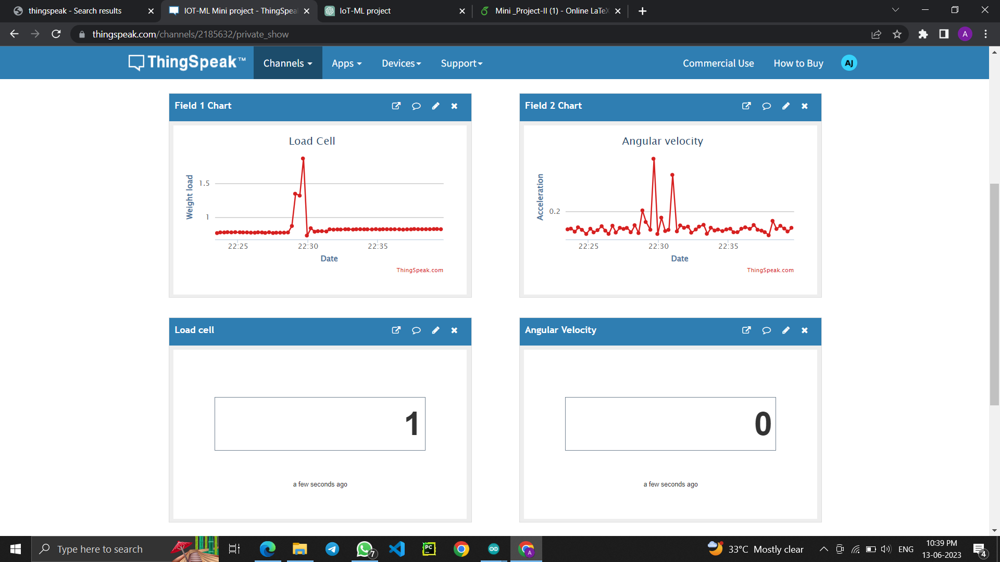
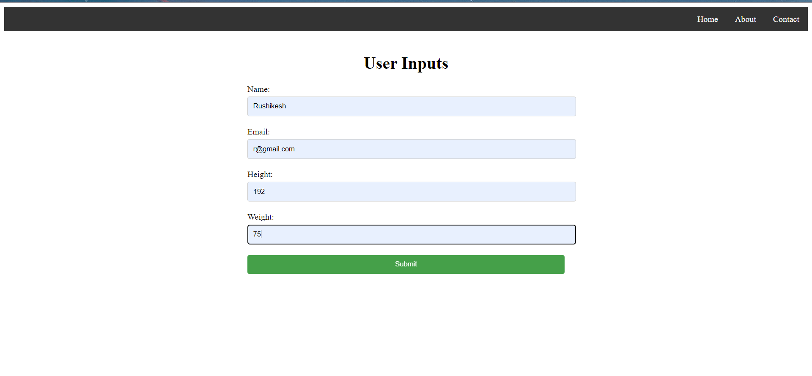
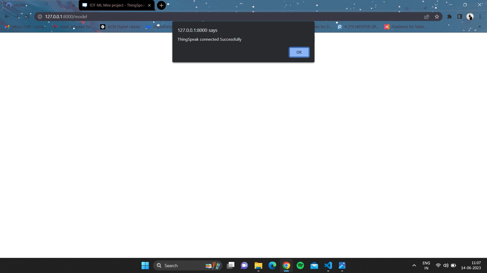
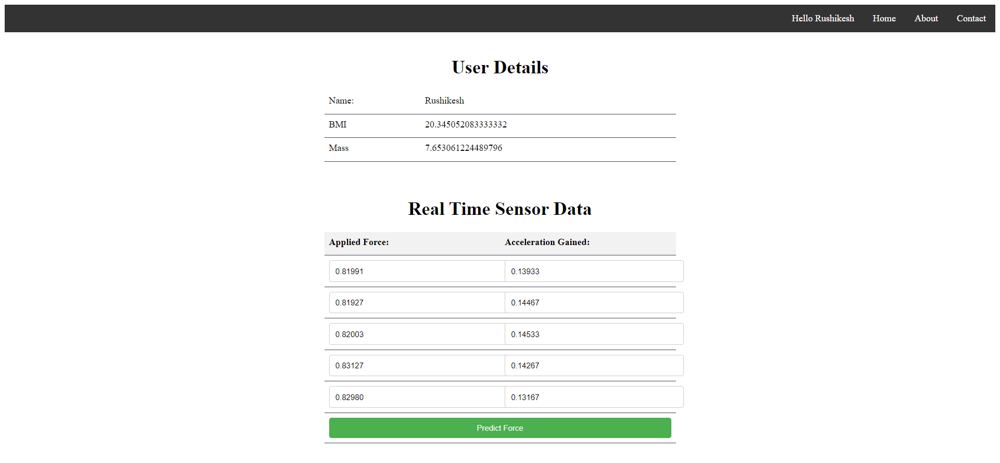
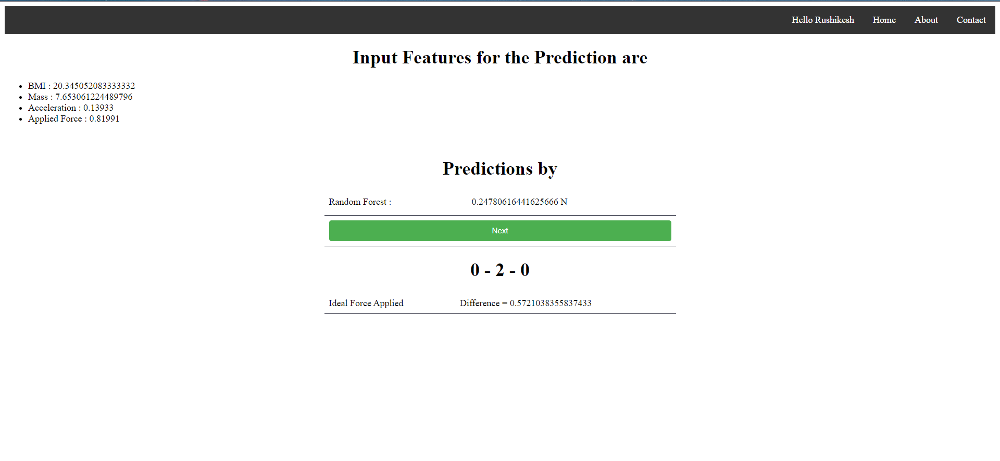

# 🚴‍♂️ IoT-Based System for Monitoring and Optimizing Cyclist Performance

--- 

## Overview

This project presents an **IoT-based system** designed to optimize cyclist performance through real-time feedback and data analysis. It employs a **50 kg Load Cell force sensor** attached to the bike’s pedal and a **Gyroscope sensor** for measuring elevation changes. The system aims to help cyclists improve their performance, reduce the risk of injury, and achieve their fitness goals by providing valuable insights and feedback.

--- 

## Features

- **Real-Time Data Collection**: Continuous monitoring of cyclist’s performance.
- **Force Measurement**: Captures the force exerted by the cyclist during pedaling.
- **Elevation Detection**: Measures terrain inclines and declines.
- **User-Friendly Interface**: Provides immediate feedback to the cyclist.
- **Performance Insights**: Offers personalized suggestions for improvement.

--- 

## Motivation

Cycling is a popular fitness activity, and optimizing performance can significantly enhance the cycling experience. Our system leverages IoT technology to provide real-time insights, helping cyclists to make informed decisions and achieve their fitness goals effectively.

--- 

## System Architecture

| ### Architecture Diagram | ### IOT Circuit Diagram |
|------------------------------------------------------|-------------------------------------------------------|
|  |  |

--- 

## System Requirements

### Hardware Requirements

| Component                    | Details                                                      |
|------------------------------|--------------------------------------------------------------|
| **Load Cell Force Sensor**   | Type: Strain Gauge Load Cell <br> Capacity: Appropriate to the expected force range during cycling |
| **HX711 Load Cell Amplifier**| For interfacing the Load Cell with the Arduino               |
| **Gyroscope Sensor**         | Model: MPU6050 or similar                                    |
| **Arduino Board**            | Model: Arduino Uno or compatible                             |
| **Breadboard and Connecting Wires** | For creating the necessary circuits                |
| **Power Supply**             | USB cable for powering the Arduino <br> Batteries if a portable setup is desired |

### Software Requirements

| Component                    | Details                                                      |
|------------------------------|--------------------------------------------------------------|
| **Arduino IDE**              | Version: 1.8.x or higher <br> [Download Arduino IDE](https://www.arduino.cc/en/software) |
| **ThingSpeak Account**       | For data visualization and analysis <br> [Sign up for ThingSpeak](https://thingspeak.com/) |
| **Libraries for Arduino**    | HX711 Library: For interfacing the Load Cell <br> MPU6050 Library: For interfacing the Gyroscope |

### Installation Steps

| Step                         | Details                                                      |
|------------------------------|--------------------------------------------------------------|
| **Arduino IDE Installation** | Download and install the Arduino IDE from the official website. |
| **Library Installation in Arduino IDE** | Open Arduino IDE <br> Go to **Sketch > Include Library > Manage Libraries** <br> Search for **HX711** and install the library <br> Search for **MPU6050** and install the library |
| **ThingSpeak Setup**         | Create an account on ThingSpeak <br> Set up a new channel for data logging <br> Note the API keys for sending data from Arduino to ThingSpeak |

### Circuit Diagram

| Connection                   | Details                                                      |
|------------------------------|--------------------------------------------------------------|
| **Load Cell Connection**     | Connect the Load Cell to the HX711 Load Cell Amplifier <br> Connect the HX711 to the Arduino |
| **Gyroscope Connection**     | Connect the MPU6050 Gyroscope to the Arduino using I2C connections (SDA, SCL) |

### Programming

| Step                         | Details                                                      |
|------------------------------|--------------------------------------------------------------|
| **Arduino Sketch**           | Load the provided `.ino` file from the repository into Arduino IDE <br> Update the code with ThingSpeak API keys <br> Upload the code to the Arduino board |

### Data Visualization

| Step                         | Details                                                      |
|------------------------------|--------------------------------------------------------------|
| **ThingSpeak Dashboard**     | Configure widgets in ThingSpeak to visualize data from the Load Cell and Gyroscope <br> Set up real-time graphs and other necessary visual tools |

--- 

## Implementation

### TimeLine


1. **Initialization**: Setting up the microcontroller (NodeMCU ESP8266), sensors (MPU6050 gyroscope and load cell), and connections.
2. **Data Acquisition**: Sensors collect data on motion and exertion continuously.
3. **Data Processing**: Data from sensors is processed to extract meaningful information.
4. **Exertion Level Calculation**: Analyzes angular velocity to determine exertion levels.
5. **Weight and BMI Calculation**: Converts force measurements to weight values and calculates BMI.
6. **Data Logging and Visualization**: Processed data is logged and visualized using platforms like ThingSpeak.

--- 

## Results

| Serial Monitor of Arduino IDE | ThingSpeak Cloud | 
|-----------------------------|-----------------------------|  
|  |  |

| Load Cell Graph | Gyroscope Graph |
|-----------------------------|-----------------------------|
|  |  |


--- 

## Screenshots

| 1 User Data Input            | 2 ThinkSpeak Cloud Connection Alert |
|-----------------------------|-----------------------------|
|  |  |


| 3 Realtime Data from Cloud | 4 Output Indication   |
|-----------------------------|-----------------------------|
|  |  |

| 5 Prediction Output |
|-----------------------------|
|  |

--- 

## Conclusion and Future Scope

The proposed IoT-based system provides a promising solution to enhance the cycling experience. By integrating sensors and real-time feedback, it enables cyclists to optimize their performance, reduce injury risks, and achieve fitness goals. Future enhancements could include integration with wearable devices and collaboration with cycling analytics platforms.

--- 

## Collaboration

We welcome contributions from the community! Follow these steps to collaborate:

1. **Fork the Repository**: Click the "Fork" button at the top right of this page.
2. **Clone Your Fork**: Clone your forked repository to your local machine.
   ```sh
   git clone https://github.com/RushikeshSonwane03/IOT_Project.git
   ```
3. **Create a Branch**: Create a new branch for your feature or bug fix
    ```sh 
    git checkout -b feature-name
    ```
4. **Make Changes**: Implement your changes and commit them with clear messages.
    ```sh
    git commit -m "Description of your changes" 
    ```
5. **Push Changes**: Push your changes to your forked repository.
    ```sh
    git push origin feature-name
    ```
6. **Create a Pull Request**: Open a pull request from your forked repository to our main repository.

--- 

## Acknowledgments

We extend our heartfelt thanks to our project guide, Dr. Makrand Shahade, and our department head, Dr. Nilesh Salunke, for their invaluable support and guidance. Special thanks to Prof. Mayuri Kulkarni (IoT Expert) and Prof. Ashish Awate (ML Expert) for their expert advice.

--- 

## Credits
- Rushikesh Sonwane - <a href="https://github.com/RushikeshSonwane03" target="_blank">GitHub Profile</a>
- Anushka Jain - <a href="https://github.com/Anushka1502" target="_blank">GitHub Profile</a>
- Mansi Patil - <a href="https://github.com/#" target="_blank">GitHub Profile</a>
- Purva Chauhan - <a href="https://github.com/Purva2002" target="_blank">GitHub Profile</a>

---

## Connect with me  
<div align="center">
<a href="https://twitter.com/therushisonwane" target="_blank">

</a>
<a href="https://github.com/RushikeshSonwane03" target="_blank">

</a>
<a href="https://dev.to/rushikeshsonwane03" target="_blank">

</a>
<a href="https://stackoverflow.com/users/https://stackoverflow.com/users/21440876/rushikesh-sonwane" target="_blank">

</a>
<a href="https://linkedin.com/in/https://www.linkedin.com/in/rushikesh-sonwane-a9739120b/" target="_blank">

</a>
<a href="https://instagram.com/therushisonwane_03" target="_blank">

</a>
<a href="https://www.kaggle.com/rushikeshsonwane" target="_blank">

</a>  
</div>  
  

<br/>  
